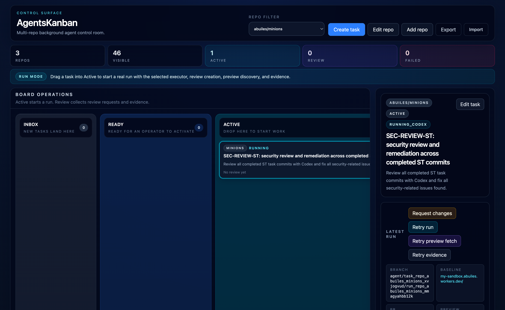

# AgentsKanban

AgentsKanban is a Cloudflare Workers application for multi-repo task orchestration with a kanban UI and background agent runs. It combines a React/Vite frontend with a Worker API that manages tasks, runs, logs, and artifacts.

[](https://deploy.workers.cloudflare.com/?url=https://github.com/abuiles/agents-kanban)

## Overview

- Multi-repo board for planning and execution
- Task lifecycle across kanban columns (`INBOX` to `DONE` / `FAILED`)
- Run orchestration with status, logs, artifacts, and retry actions
- Human-in-the-loop control: operators can attach to a live run, take over the sandbox, and steer agent behavior when needed
- Cloudflare-native runtime components (Durable Objects, Workflows, R2, D1, KV, Containers)

## Inspiration

This project was inspired by Stripe's Minions work on one-shot, end-to-end coding agents:

- [Minions: Stripe's One-Shot End-to-End Coding Agents](https://stripe.dev/blog/minions-stripes-one-shot-end-to-end-coding-agents)
- [Minions: Stripe's One-Shot End-to-End Coding Agents (Part 2)](https://stripe.dev/blog/minions-stripes-one-shot-end-to-end-coding-agents-part-2)

## Screenshot



## Architecture Summary

- UI: React + Vite static assets served by Workers assets binding
- API: Worker routes under `/api/*`
- Stateful control plane: Durable Objects (`BOARD_INDEX`, `REPO_BOARD`, `Sandbox`)
- Background orchestration: Workflows binding (`RUN_WORKFLOW`)
- Storage:
  - R2 bucket (`RUN_ARTIFACTS`) for run artifacts and bundles
  - D1 database (`TENANT_DB`) for tenant/auth persistence
  - KV namespace (`SECRETS_KV`) for secrets/metadata support
- Ephemeral execution: Cloudflare Containers-backed sandbox class (`Sandbox`) using Cloudflare's default Sandbox Docker image (`docker.io/cloudflare/sandbox:0.7.8`) for now
- Diagram: [docs/architecture.md](docs/architecture.md)

## Requirements

- Cloudflare account authenticated via Wrangler (`wrangler login`)
- Workers plan that supports Cloudflare Sandbox/Containers usage
- Runtime provider/API credentials, depending on your repos:
  - `GITHUB_TOKEN` (GitHub repos)
  - `GITLAB_TOKEN` (GitLab repos)
  - `OPENAI_API_KEY` (LLM execution)
- Cloudflare bindings configured in `wrangler.jsonc`:
  - Durable Objects: `Sandbox`, `BOARD_INDEX`, `REPO_BOARD`
  - Workflow: `RUN_WORKFLOW`
  - R2: `RUN_ARTIFACTS`
  - D1: `TENANT_DB`
  - KV: `SECRETS_KV`

## Prerequisites

- Node.js 20+ and npm
- Cloudflare account authenticated via Wrangler
- `wrangler.jsonc` bindings provisioned in your account
- SCM and model provider credentials as needed:
  - `GITHUB_TOKEN` and/or `GITLAB_TOKEN`
  - `OPENAI_API_KEY`

## Local Setup

1. Install dependencies:

```bash
npm install
```

2. Configure local/remote secrets (example):

```bash
npx wrangler secret put GITHUB_TOKEN
npx wrangler secret put GITLAB_TOKEN
npx wrangler secret put OPENAI_API_KEY
```

3. On deploy, Wrangler auto-provisions `TENANT_DB` if it does not already exist in your Cloudflare account.

4. If bindings changed, regenerate Worker types:

```bash
npx wrangler types
```

5. Build and start local development:

```bash
npm run build
npm run dev
```

Default local app URL is `http://localhost:5173` with API under `http://localhost:5173/api`.

## Cloud Deploy Quick Start

1. Install dependencies:

```bash
npm install
```

2. Set required runtime secrets:

```bash
npx wrangler secret put GITHUB_TOKEN
npx wrangler secret put GITLAB_TOKEN
npx wrangler secret put OPENAI_API_KEY
```

3. Deploy:

```bash
npm run deploy
```

4. Apply D1 migrations on the remote database:

```bash
npx wrangler d1 migrations apply TENANT_DB --remote
```

5. Optional: bootstrap single-tenant seed data:

```bash
npm run bootstrap:single-tenant -- --input ./scripts/bootstrap-single-tenant.example.json --remote
```

For deeper setup and troubleshooting, see [docs/local-testing.md](docs/local-testing.md) and [docs/features-and-api.md](docs/features-and-api.md).

## Commands

Project scripts from `package.json`:

```bash
npm run dev
npm run build
npm run test
npm run test:workers
npm run deploy
```

## Bootstrap Single-Tenant Data

Use the bootstrap script to seed `TENANT_DB` with tenant config and initial owner users.

Example input file:

```bash
scripts/bootstrap-single-tenant.example.json
```

Run against local D1:

```bash
npm run bootstrap:single-tenant -- --input ./scripts/bootstrap-single-tenant.example.json --local
```

Run against remote D1:

```bash
npm run bootstrap:single-tenant -- --input ./scripts/bootstrap-single-tenant.example.json --remote
```

Supported options:

```text
--input <path> (required)
--local | --remote
--db TENANT_DB
--config wrangler.jsonc
--env <name>
--persist-to <dir>
--dry-run
```

## Cloudflare Bindings and Secrets

Bindings defined in `wrangler.jsonc` include:

- Durable Objects: `Sandbox`, `BOARD_INDEX`, `REPO_BOARD`
- Workflow: `RUN_WORKFLOW`
- R2: `RUN_ARTIFACTS`
- D1: `TENANT_DB`
- KV: `SECRETS_KV`
- Assets: `ASSETS`

Use Worker secrets for sensitive values (do not store secrets in `vars`). For local development, use `.dev.vars` or `.env` per Cloudflare Workers documentation.

## API Workflow

For operator/API flow and request sequence, use [docs/api_prompt.md](docs/api_prompt.md).

## Roadmap

Current roadmap is organized as P1-P4:

- P1: Single-tenant foundation
- P2: Control and explainability
- P3: Scale and scheduling
- P4: Security and governance

See [docs/roadmap.md](docs/roadmap.md) for details and [docs/plans/current/README.md](docs/plans/current/README.md) for active plan docs.

## Codex Auth (ChatGPT Account)

If you want sandbox runs to use your ChatGPT-linked Codex CLI auth, upload a `.codex` auth bundle to R2 and point the Worker at it.

1. Build a minimal `.codex` bundle from your local machine:

```bash
tmp_dir="$(mktemp -d)"
mkdir -p "$tmp_dir/.codex"
cp "$HOME/.codex/auth.json" "$tmp_dir/.codex/auth.json"
cp "$HOME/.codex/config.toml" "$tmp_dir/.codex/config.toml"
tar -czf codex-auth.tgz -C "$tmp_dir" .codex
rm -rf "$tmp_dir"
```

2. Upload it to the run artifacts bucket:

```bash
npx wrangler r2 object put my-sandbox-run-artifacts/auth/codex-auth.tgz --file ./codex-auth.tgz --remote
```

3. Set the global bundle key secret used by the Worker:

```bash
npx wrangler secret put CODEX_AUTH_BUNDLE_R2_KEY
```

Use this value:

```text
auth/codex-auth.tgz
```

Notes:
- The Worker restores this bundle into the sandbox before invoking `codex`.
- Keep `auth.json` private; never commit or share it.
- If auth fails, check `docs/local-testing.md` troubleshooting for Codex bundle diagnostics.

## Key Docs

- [docs/plans/current/README.md](docs/plans/current/README.md)
- [docs/plans/current/p1-single-tenant-foundation.md](docs/plans/current/p1-single-tenant-foundation.md)
- [docs/features-and-api.md](docs/features-and-api.md)
- [docs/local-testing.md](docs/local-testing.md)
- [docs/roadmap.md](docs/roadmap.md)
- Cloudflare Workers docs: https://developers.cloudflare.com/workers/
- Cloudflare Workers bindings: https://developers.cloudflare.com/workers/configuration/bindings/
- Cloudflare Workers env vars and secrets:
  - https://developers.cloudflare.com/workers/development-testing/environment-variables/
  - https://developers.cloudflare.com/workers/configuration/secrets/

## License

This project is licensed under the MIT License. See [LICENSE](LICENSE).
