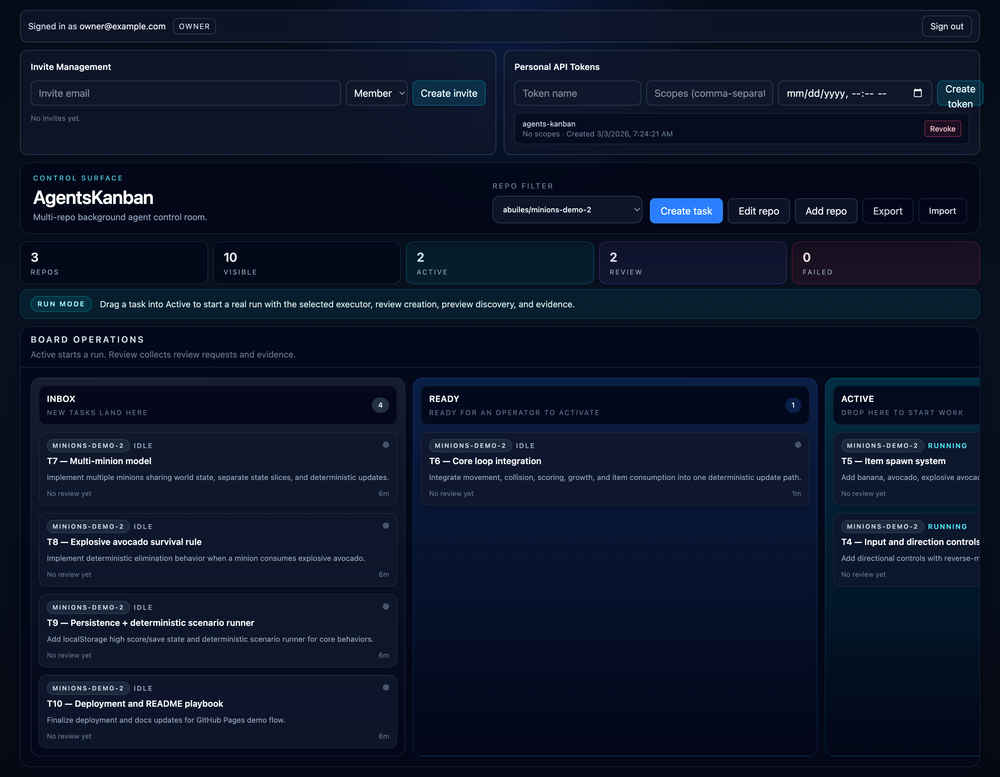

# AgentsKanban

AgentsKanban helps you run AI-assisted software work the same way you already manage projects: on a Kanban board. You create tasks, connect dependencies, run agents in parallel, and step in as a human anytime.

[](https://deploy.workers.cloudflare.com/?url=https://github.com/abuiles/agents-kanban)

## Overview

- Plan and track work across multiple repositories from one board
- See each task move clearly from queued work to completed work
- Connect tasks so downstream work waits for upstream work to be ready
- Run background agents and review results, logs, previews, and retries in one place
- Work with either GitHub or GitLab repositories
- Let a human step in at any time to inspect, guide, or take over a run

## Features

### Board & Task Management

- Manage many repositories from one shared board
- Use clear task stages (`INBOX`, `READY`, `ACTIVE`, `REVIEW`, `DONE`, `FAILED`)
- Create and edit tasks with goals, instructions, links, and acceptance criteria
- Filter by repository when you want a focused view

### Dependency-Aware Execution

- Define which tasks must be completed before others can start
- Keep dependent work blocked until upstream work is review-ready
- See why a task is blocked and when it becomes unblocked
- Select a primary dependency when a task depends on multiple tasks

### Run Lifecycle, Preview, and Evidence

- Track each run from queued to done or failed with a visible timeline
- Start and retry runs, preview checks, and evidence capture
- Automatically discover preview URLs and gather before/after evidence
- Review logs and outputs for every run
- Recover failed runs from deterministic phase checkpoints with automatic latest-checkpoint retry defaults

### Auto Review and Selective Change Loop

- Runs can auto-trigger review when `autoReview` is enabled and the run reaches review state.
- Review findings are posted to GitHub, GitLab, or Jira with marker-based idempotency.
- Operators can request changes against all findings or a selected subset (`all`, `include`, `exclude`, `freeform`).
- Replies from providers can be included in follow-up prompts when `reviewSelection.includeReplies = true`.
- For GitHub, reply context is merged from webhook-ingested hints (`POST /api/integrations/github/webhook`) and on-demand provider fetch with deterministic dedupe.
- Manual reruns are available via `POST /api/runs/:runId/review`.

### Native Sentinel Orchestration

- Repo-level sentinel controls are available in API/UI (`start`, `pause`, `resume`, `stop`) when `sentinelConfig.enabled = true`.
- Sentinel emits an operator timeline (`GET /api/repos/:repoId/sentinel/events`) with actionable metadata for gate, merge, and remediation paths.
- Progression is race-hardened with per-run controller leases and idempotent start semantics (single running sentinel per repo).
- Merge and remediation behavior follows repo policy (`reviewGate`, `mergePolicy`, `conflictPolicy`).
- Script-based automation (`scripts/autopilot.sh`, `scripts/p5-sentinel.sh`) can be retired in favor of native sentinel controls.

### Slack, Jira, and GitLab MVP Loop

- Trigger task execution from Slack slash commands with a Jira issue key (`/kanvy fix ABC-123`).
- Resolve Jira project -> repository mapping and start the first run from `main`.
- Mirror GitLab MR lifecycle and review feedback into the same Slack thread.
- Gate reruns behind explicit Slack approval (`approve rerun`) in-thread.
- Keep one Slack thread binding per task across review rounds for day-to-day operator flow.

### Operator Controls

- Watch live run events and command history
- Open a live terminal into an active run environment
- Inspect what is happening while the run is in progress
- Take control from the agent when manual intervention is needed

### Repository & SCM Support

- Works with both GitHub and GitLab
- Store and manage source control credentials per provider and repository
- Configure preview and evidence behavior at the repository level

### Tenant and Access Foundations

- Built-in tenant, login, and membership support
- Invite-based onboarding and support-session workflows
- Usage reporting at tenant and run level

## Inspiration

This project is inspired by Stripe's Minions work on one-shot, end-to-end coding agents:

- [Minions: Stripe's One-Shot End-to-End Coding Agents](https://stripe.dev/blog/minions-stripes-one-shot-end-to-end-coding-agents)
- [Minions: Stripe's One-Shot End-to-End Coding Agents (Part 2)](https://stripe.dev/blog/minions-stripes-one-shot-end-to-end-coding-agents-part-2)

## Screenshot



## Architecture Summary

- UI: React + Vite static assets served by Workers assets binding
- API: Worker routes under `/api/*`
- Stateful control plane: Durable Objects (`BOARD_INDEX`, `REPO_BOARD`, `Sandbox`)
- Background orchestration: Workflows binding (`RUN_WORKFLOW`)
- Storage:
  - R2 bucket (`RUN_ARTIFACTS`) for run artifacts and bundles
  - D1 database (`TENANT_DB`) for tenant/auth persistence
  - KV namespace (`SECRETS_KV`) for secrets/metadata support
- Ephemeral execution: Cloudflare Containers-backed sandbox class (`Sandbox`) using Cloudflare's default Sandbox Docker image (`docker.io/cloudflare/sandbox:0.7.8`) for now
- Diagram: [docs/architecture.md](docs/architecture.md)

## Requirements

- Cloudflare account authenticated via Wrangler (`wrangler login`)
- Workers plan that supports Cloudflare Sandbox/Containers usage
- Runtime provider/API credentials, depending on your repos:
  - `GITHUB_TOKEN` (GitHub repos)
  - `GITLAB_TOKEN` (GitLab repos)
  - `JIRA_TOKEN` (Jira provider for review posting)
  - `OPENAI_API_KEY` (LLM execution)
- Cloudflare bindings configured in `wrangler.jsonc`:
  - Durable Objects: `Sandbox`, `BOARD_INDEX`, `REPO_BOARD`
  - Workflow: `RUN_WORKFLOW`
  - R2: `RUN_ARTIFACTS`
  - D1: `TENANT_DB`
  - KV: `SECRETS_KV`

## Prerequisites

- Node.js 20+ and npm
- Cloudflare account authenticated via Wrangler
- `wrangler.jsonc` bindings provisioned in your account
- SCM and model provider credentials as needed:
  - `GITHUB_TOKEN` and/or `GITLAB_TOKEN`
  - `OPENAI_API_KEY`

## GitHub PAT Setup (`GITHUB_TOKEN`)

If you use GitHub repos, create a GitHub Personal Access Token and provide it as `GITHUB_TOKEN`.

Recommended: Fine-grained personal access token

1. GitHub: **Settings → Developer settings → Personal access tokens → Fine-grained tokens → Generate new token**
2. Resource owner: your user/org that owns the target repo
3. Repository access: select the target repo(s)
4. Repository permissions (minimum practical set):
   - Contents: **Read and write**
   - Pull requests: **Read and write**
   - Metadata: **Read-only** (usually default)
5. Copy the token once (GitHub will not show it again)

Set it for local development in `.dev.vars`:

```text
GITHUB_TOKEN=<your_github_pat>
```

Set it for deployed Worker runtime:

```bash
npx wrangler secret put GITHUB_TOKEN
```

## Local Setup

1. Install dependencies:

```bash
npm install
```

2. Configure local/remote secrets (example):

```bash
npx wrangler secret put GITHUB_TOKEN
npx wrangler secret put GITLAB_TOKEN
npx wrangler secret put JIRA_TOKEN
npx wrangler secret put OPENAI_API_KEY
```

3. On deploy, Wrangler auto-provisions `TENANT_DB` if it does not already exist in your Cloudflare account.

4. If bindings changed, regenerate Worker types:

```bash
npx wrangler types
```

5. Build and start local development:

```bash
npm run build
npm run dev
```

Default local app URL is `http://localhost:5173` with API under `http://localhost:5173/api`.

## Cloud Deploy Quick Start

1. Install dependencies:

```bash
npm install
```

2. Set required runtime secrets:

```bash
npx wrangler secret put GITHUB_TOKEN
npx wrangler secret put GITLAB_TOKEN
npx wrangler secret put OPENAI_API_KEY
```

3. Deploy:

```bash
npm run deploy
```

4. Apply D1 migrations on the remote database:

```bash
npx wrangler d1 migrations apply TENANT_DB --remote
```

5. Optional: bootstrap single-tenant seed data:

```bash
npm run bootstrap:single-tenant -- --input ./scripts/bootstrap-single-tenant.example.json --remote
```

For deeper setup and troubleshooting, see [docs/local-testing.md](docs/local-testing.md), [docs/features-and-api.md](docs/features-and-api.md), [docs/integrations/checkpoint-recovery.md](docs/integrations/checkpoint-recovery.md), [docs/integrations/slack-jira-gitlab-mvp.md](docs/integrations/slack-jira-gitlab-mvp.md), [docs/integrations/auto-review-change-loop.md](docs/integrations/auto-review-change-loop.md), and [docs/integrations/sentinel-orchestration.md](docs/integrations/sentinel-orchestration.md).

## Onboarding Prompts

Use these prompt docs when you want guided setup/testing or task-creation workflows with an LLM:

- Local setup Q&A (local-only, no `--remote` flow):
  [docs/prompts/local-onboarding-qa-prompt.md](docs/prompts/local-onboarding-qa-prompt.md)
- Empty-repo task bootstrap for Minions Snake demo (plan-first task prompts + dependency graph):
  [docs/prompts/minions-snake-empty-repo-onboarding.md](docs/prompts/minions-snake-empty-repo-onboarding.md)

## Commands

Project scripts from `package.json`:

```bash
npm run dev
npm run build
npm run test
npm run test:workers
npm run deploy
```

## Bootstrap Single-Tenant Data

Use the bootstrap script to seed `TENANT_DB` with tenant config and initial owner users.

Example input file:

```bash
scripts/bootstrap-single-tenant.example.json
```

Run against local D1:

```bash
npm run bootstrap:single-tenant -- --input ./scripts/bootstrap-single-tenant.example.json --local
```

Run against remote D1:

```bash
npm run bootstrap:single-tenant -- --input ./scripts/bootstrap-single-tenant.example.json --remote
```

Supported options:

```text
--input <path> (required)
--local | --remote
--db TENANT_DB
--config wrangler.jsonc
--env <name>
--persist-to <dir>
--dry-run
```

## Cloudflare Bindings and Secrets

Bindings defined in `wrangler.jsonc` include:

- Durable Objects: `Sandbox`, `BOARD_INDEX`, `REPO_BOARD`
- Workflow: `RUN_WORKFLOW`
- R2: `RUN_ARTIFACTS`
- D1: `TENANT_DB`
- KV: `SECRETS_KV`
- Assets: `ASSETS`

Use Worker secrets for sensitive values (do not store secrets in `vars`). For local development, use `.dev.vars` or `.env` per Cloudflare Workers documentation.

## API Workflow

For operator/API flow and request sequence, use [docs/api_prompt.md](docs/api_prompt.md).

## Roadmap

Current roadmap is organized as P1-P4:

- P1: Single-tenant foundation
- P2: Control and explainability
- P3: Scale and scheduling
- P4: Security and governance

Near-term planned capabilities (not fully implemented yet):

- P2 (Control and explainability): run audit endpoint, richer transition rationale, safe cancel semantics
- P3 (Scale and scheduling): queued/blocked reason codes, per-repo and global concurrency behavior, fairness/backpressure controls

See [docs/roadmap.md](docs/roadmap.md) for details and [docs/plans/current/README.md](docs/plans/current/README.md) for active plan docs.

## Codex Auth (ChatGPT Account)

If you want sandbox runs to use your ChatGPT-linked Codex CLI auth, upload a `.codex` auth bundle to R2 and point the Worker at it.

1. Build a minimal `.codex` bundle from your local machine:

```bash
tmp_dir="$(mktemp -d)"
mkdir -p "$tmp_dir/.codex"
cp "$HOME/.codex/auth.json" "$tmp_dir/.codex/auth.json"
cp "$HOME/.codex/config.toml" "$tmp_dir/.codex/config.toml"
tar -czf codex-auth.tgz -C "$tmp_dir" .codex
rm -rf "$tmp_dir"
```

2. Upload it to the run artifacts bucket:

```bash
npx wrangler r2 object put my-sandbox-run-artifacts/auth/codex-auth.tgz --file ./codex-auth.tgz --remote
```

3. Set the global bundle key secret used by the Worker:

```bash
npx wrangler secret put CODEX_AUTH_BUNDLE_R2_KEY
```

Use this value:

```text
auth/codex-auth.tgz
```

Notes:
- The Worker restores this bundle into the sandbox before invoking `codex`.
- Keep `auth.json` private; never commit or share it.
- If auth fails, check `docs/local-testing.md` troubleshooting for Codex bundle diagnostics.

## Key Docs

- [docs/plans/current/README.md](docs/plans/current/README.md)
- [docs/plans/current/p1-single-tenant-foundation.md](docs/plans/current/p1-single-tenant-foundation.md)
- [docs/plans/current/p2-control-and-explainability.md](docs/plans/current/p2-control-and-explainability.md)
- [docs/plans/current/p3-scale-and-scheduling.md](docs/plans/current/p3-scale-and-scheduling.md)
- [docs/features-and-api.md](docs/features-and-api.md)
- [docs/tenant-auth-api.md](docs/tenant-auth-api.md)
- [docs/api_prompt.md](docs/api_prompt.md)
- [docs/local-testing.md](docs/local-testing.md)
- [docs/roadmap.md](docs/roadmap.md)
- Cloudflare Workers docs: https://developers.cloudflare.com/workers/
- Cloudflare Workers bindings: https://developers.cloudflare.com/workers/configuration/bindings/
- Cloudflare Workers env vars and secrets:
  - https://developers.cloudflare.com/workers/development-testing/environment-variables/
  - https://developers.cloudflare.com/workers/configuration/secrets/

## License

This project is licensed under the MIT License. See [LICENSE](LICENSE).

## Managed Option

If you want a managed option, we can set up and operate AgentsKanban for you.

Commercial terms:
- No markup on tokens.
- You own the OpenAI account/instance and the Cloudflare account.
- We charge a fixed fee based on the number of people using it.

We also offer a one-time setup engagement for a fixed fee.

For details, reach out at: builes.adolfo@gmail.com
