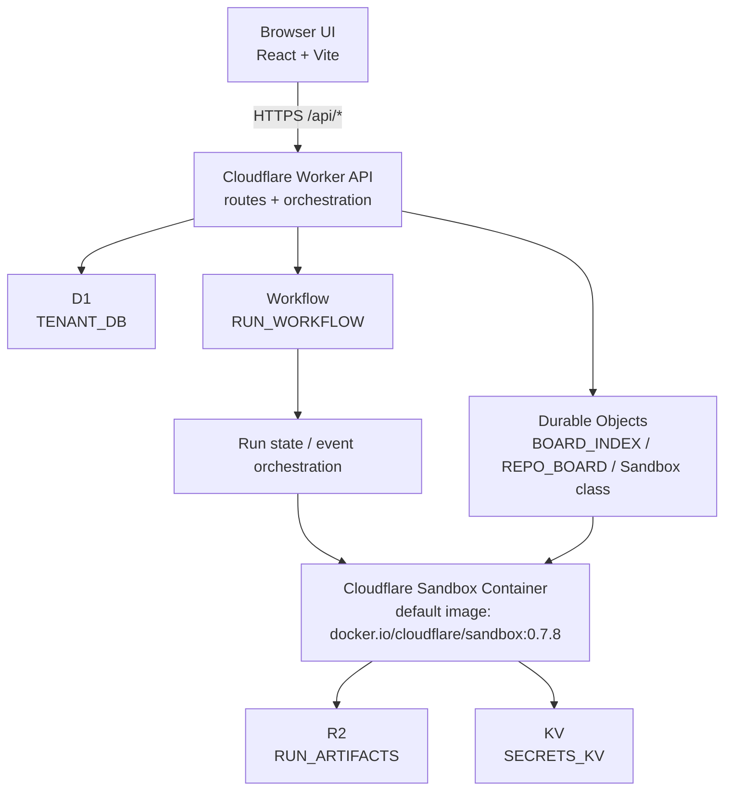

# Architecture Diagram

```mermaid
flowchart TD
    UI["Browser UI<br/>React + Vite"] -->|HTTPS /api/*| API["Cloudflare Worker API<br/>routes + orchestration"]

    API --> D1["D1<br/>TENANT_DB"]
    API --> DO["Durable Objects<br/>BOARD_INDEX / REPO_BOARD / Sandbox class"]
    API --> WF["Workflow<br/>RUN_WORKFLOW"]

    WF --> ORCH["Run state / event orchestration"]
    ORCH --> SB["Cloudflare Sandbox Container<br/>default image: docker.io/cloudflare/sandbox:0.7.8"]
    DO --> SB

    SB --> R2["R2<br/>RUN_ARTIFACTS"]
    SB --> KV["KV<br/>SECRETS_KV"]
```
